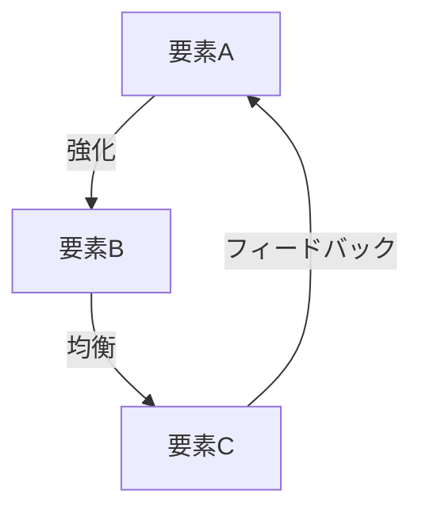

# Thinking Frameworks Reference

Phase 1.1a でテーマの性質に応じて1-2個を選択し、Phase 4 で適用する。

---

## First Principles（第一原理思考）

**選択基準**: 技術選定、アーキテクチャ設計、「既存の方法が本当に最善か」を問うテーマ

**Phase 4 での適用:**
1. 対象を構成要素に分解する（「何が本当に必要か」）
2. 各要素の存在理由を問う（「なぜそれが必要か」→「それがないとどうなるか」）
3. 慣習・前例を一旦排除し、必要要素だけから再構築する
4. 再構築した結論が既存手法と異なる場合、その差分を根拠付きで説明する

**出力形式:**
```
### First Principles 分解
| 構成要素 | 存在理由 | 本当に必要か | 根拠 |
|---------|---------|------------|------|
```

---

## Inversion（逆転思考）

**選択基準**: リスク分析、戦略判断、「何をすべきか」より「何を避けるべきか」が重要なテーマ

**Phase 4 での適用:**
1. 「このテーマで確実に失敗する方法」を5-10個列挙する
2. 各失敗パターンの発生確率と影響度を評価する
3. 提案が失敗パターンに該当しないことを検証する
4. 高確率の失敗パターンに対する予防策を提案に組み込む

**出力形式:**
```
### Inversion: 失敗パターン分析
| # | 確実に失敗する方法 | 発生確率 | 影響度 | 提案との関連 | 予防策 |
|---|-------------------|---------|--------|-------------|--------|
```

---

## Second-Order Effects（二次効果思考）

**選択基準**: プラットフォーム選定、事業判断、長期的影響が重要なテーマ

**Phase 4 での適用:**
1. 提案の直接的効果（一次効果）を列挙する
2. 各一次効果から派生する二次効果を推論する
3. 二次効果からさらに派生する三次効果まで追う
4. 意図しない悪影響（副作用）を特定する

**出力形式:**
```
### Second-Order Effects チェーン
| 一次効果 | → 二次効果 | → 三次効果 | 副作用リスク |
|---------|-----------|-----------|------------|
```

---

## Hypothesis-Driven（仮説駆動思考）

**選択基準**: 市場調査、ユーザー行動分析、「答えがわからない問い」に対するテーマ

**Phase 4 での適用:**
1. テーマに対する仮説を2-3個立てる（Phase 1の時点で仮決め→Phase 4で検証）
2. 各仮説を支持する証拠と反証する証拠を**両方**集める（確証バイアス防止）
3. 証拠の重みで仮説を判定する（支持/棄却/保留）
4. 棄却された仮説からも学びを抽出する

**出力形式:**
```
### 仮説検証
| 仮説 | 支持する証拠 | 反証する証拠 | 判定 | 学び |
|------|------------|------------|------|------|
```

---

## Systems Thinking（システム思考）

**選択基準**: 組織・エコシステム分析、複数の要素が相互作用するテーマ

**Phase 4 での適用:**
1. システムの構成要素と関係性をマッピングする（Mermaid図推奨）
2. フィードバックループ（強化ループ/均衡ループ）を特定する
3. ボトルネック（制約）を特定する
4. 介入ポイント（小さな変化で大きな効果が出る箇所）を特定する

**出力形式:**


---

## Pre-mortem（事前検死）

**選択基準**: プロジェクト計画、大きな意思決定、「失敗したくない」テーマ

**Phase 4 での適用:**
1. 「この提案を実行して1年後、完全に失敗した」と仮定する
2. チームメンバーの視点で「なぜ失敗したか」の原因を10個列挙する
3. 各原因の発生可能性を評価する
4. 発生可能性が高い原因に対する予防策を提案に組み込む

**出力形式:**
```
### Pre-mortem: 失敗原因の逆算
| # | 失敗原因 | 発生可能性 | 検知可能性 | 予防策 |
|---|---------|-----------|-----------|--------|
```
