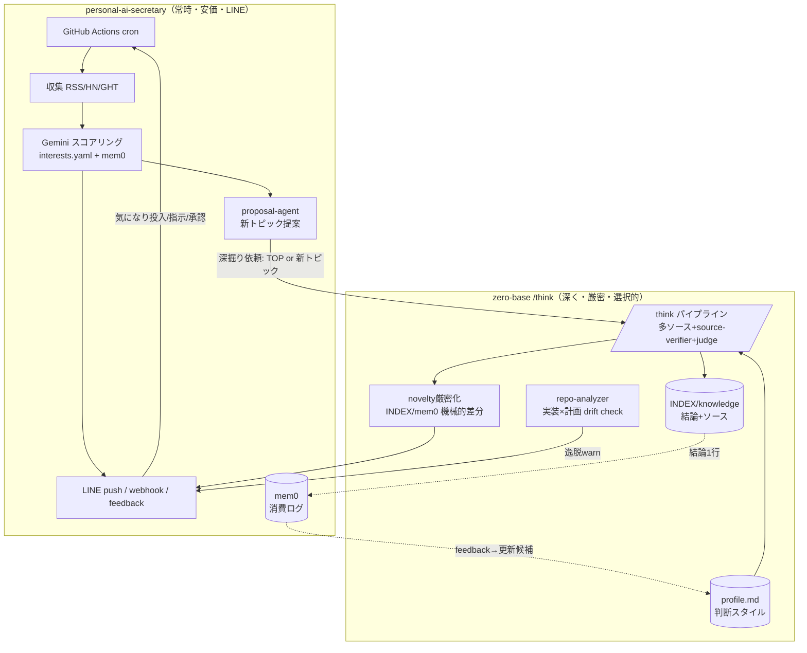
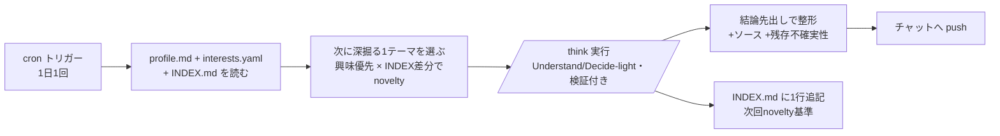

# 自律リサーチ体制 — 設計ドキュメント（2リポジトリ統合版）

> rio の理想像「嗜好を元に、指示なしで毎日自動リサーチを回し、実装進捗の計画整合性もチェックし、既知に無い面白い発見をチャットで報告。双方向で気になりも投げられる」を実装するための設計。
>
> **成果物モード = Design**（アーキテクチャ + 段階ロードマップまで。実装は各Phaseで rio 承認後）。

## 採用方針（2026-07-15 rio確定）: zero-base を頭にする

**前提の更新（重要）**: secretary の現状出力は **rio 評価で「全然有用でない」**（Gemini flash が RSS 見出しを浅くスコアするだけ・AI話題に限定）。よって **secretary を土台に育てる方針は棄却**。

- **リサーチの頭 = zero-base /think**（検証付き・多ソース・source-verifier・judge）。**有用な深掘りを自動で届ける**のが統合の狙い。
- **secretary からは「使える配管」だけ再利用**（cron・チャット配信・重複除外メモリ・候補ソース収集）。**弱い頭（Gemini scoring/proposal）は使わない**。
- **チャットは LINE 継続 or Telegram 移行どちらも可**（rio: Telegramが優れているならそちらでOK）。v1はコスト最小で選ぶ。
- 冒頭の「未整理・重複」問題は残るが、**頭を zero-base に一本化**することで嗜好/メモリの正本も zero-base 側（profile.md / INDEX）に寄せやすくなる（下記 §3 の整流は「zero-base を正」に単純化）。

> 以下 §1–§8 は secretary の実体調査と prior art に基づく分析。**採用アーキテクチャは本節（zero-base as brain）が最新**で、§4 の2層図はその具体形。

## TL;DR（更新後）

- **zero-base(/think) を頭**に、secretary の**使える配管だけ**再利用して、**有用な深掘りリサーチを自動でチャット配信**する。
- secretary の弱いスコアリング/提案は捨てる。理想像の「面白い発見」「整合性チェック」は zero-base の novelty厳密化 + repo-analyzer で作る。
- v1 = 「自動で1本、検証付きの深掘りがチャットに届く」最小ループ（下記 §9）。

---

## 1. 現状（personal-ai-secretary の実体・ground truth）

| 理想像の要素 | 実装状況 | 実体（ファイル） |
|---|---|---|
| 定期自動実行 | ✅ | GitHub Actions cron（daily 10:00 JST / weekly月 / monthly1日）。`workflow_dispatch` 手動も可 |
| 嗜好を元に | ✅ | `data/interests.yaml`（topics+weight+keywords）＋ mem0 feedback で補正 |
| 収集（マルチソース） | ✅ | `tools/`: rss-fetcher / hackernews / github-trending / perplexity-search |
| スコアリング | ✅ | `agents/scoring-agent.ts`（Gemini 2.5 Flash・当たり日ボーナス・重複除外） |
| チャット双方向 | ✅ **LINE** | push（`tools/line-notify.ts`）＋ inbound（`handlers/line-webhook.ts`）＋ **Quick Reply feedback**（参考/興味なし/後で） |
| 直近リサーチの記憶 | ✅ | **mem0**（`memory/interest-profile.ts`）: daily digest / feedback / sent-urls |
| 既知に無い面白い発見 | 🟡 **実装済だが浅い** | `agents/proposal-agent.ts`（月次digestから Gemini が3-5新トピック提案）。**単発Gemini・INDEX差分なし・検証なし** |
| 深掘りリサーチ | 🟡 **軽量のみ** | `agents/research-agent.ts` = Perplexity 300字要約。**多ソース検証・cross-model なし** |
| 学び記録 | 🟡 | `tools/github-writer.ts`（GitHub Contents APIでcommit）は有り。reports自動化は要確認 |
| 実装×計画の整合性チェック | ❌ **なし** | どちらのロードマップにも無い |
| コスト | ✅ | 月額 < $0.10（Gemini無料枠＋Python収集） |

**→ 「ambient層（常時・安価・LINE）」は完成度が高い。欠けているのは「深さ・厳密さ・整合性チェック」で、そこが zero-base の領分。**

---

## 2. Gap分析（理想像 × 充足元）

| 理想像の要求 | 充足元 | 残ギャップ |
|---|---|---|
| 毎日N回・指示なし自動 | secretary の cron（回数はcron追加で調整可） | なし |
| 嗜好駆動 | interests.yaml + mem0 | **profile.md と二重**（後述3） |
| 既知に無い面白い発見 | proposal-agent（浅い） | **novelty の厳密化**（INDEX/mem0差分＋「LLMは意外情報に弱い」対策＝機械的差分） |
| 深く正確なリサーチ | research-agent（Perplexity軽量） | **zero-base /think（多ソース・source-verifier・cross-model・judge）を「深堀り層」として接続** |
| 実装が計画通りか | — | **zero-base repo-analyzer モードで drift check を新設** |
| 双方向チャット | LINE（完成） | なし（Telegram不要） |
| 気になり投入→嗜好学習 | line-webhook + mem0 feedback | 自由文の「気になり」→ interests/profile 更新の配線 |

---

## 3. 重複の解消（＝rio が最初に挙げた「未整理」問題の正体）

いま **嗜好モデルが2つ・メモリが2つ**あり、放置すると必ず乖離する:

| 種別 | secretary 側 | zero-base 側 | 衝突 |
|---|---|---|---|
| 嗜好モデル | `data/interests.yaml`（**話題の分類＋重み＋keyword**。スコアリング用） | `knowledge/profile.md`（**判断スタイル・提示の好み・地雷**。/think提案の当てはめ用） | 役割は違うが「rioの興味」で重なる領域あり |
| メモリ | **mem0**（記事digest・feedback・sent-urls） | `workspace/INDEX.md`＋`knowledge/`（リサーチ結論・検証済ソース・失敗クエリ） | 「何を調べた/何が分かった」で重なる |

**解決方針（推奨）= 役割で単一責任を切る（single source of truth を種類ごとに1つ）**:
- **interests.yaml = 「何の話題を拾うか」の唯一の真実源**（機械スコアリング用の taxonomy）。
- **profile.md = 「rioがどう判断し・どう提示されたいか」の唯一の真実源**（/think の当てはめ・提示用）。両者は**参照し合うが複製しない**。profile.md 冒頭に「話題taxonomyは interests.yaml を正とする」と明記。
- **mem0 = 日々の消費ログ（記事・feedback）**、**INDEX/knowledge = 深いリサーチの結論・ソース**。深堀り(/think)結果の1行要約だけを mem0 にも書き戻し、逆に mem0 の feedback から profile.md 更新候補を吸い上げる**一方向ブリッジ**を1本だけ引く（双方向同期は複雑＝避ける）。

これで「2つに増えたが未整理」を「2つだが責任が分かれ・ブリッジ1本」に整流する。

---

## 4. ターゲット・アーキテクチャ（2層 = ambient + deep）

**接続の実装選択肢**（Phase Dで ownership 判断）:
1. secretary の GitHub Actions から zero-base の /think を **Claude Code Routines / CLI / Agent SDK** で起動し、結果を LINE へ。
2. zero-base 側に「secretary 向け薄いエンドポイント」を用意し secretary が叩く。
3. 当面は**手動トリガー**（secretary が「深掘り候補」を LINE 提示 → rio が承認 → zero-base /think 起動）。まずは3で疎結合に。

---

## 5. 段階ロードマップ（統合・re-build しない）

| Phase | 成果物 | 主担当 | 新規作業 |
|---|---|---|---|
| **P1: 重複の整流** | interests.yaml / profile.md / mem0 / INDEX の責任分担を確定＋ブリッジ1本の仕様 | zero-base | ドキュメント＋profile.md冒頭に参照宣言＋feedback→profile吸上げ設計 |
| **P2: 深堀り接続** | secretary の「TOP1深掘り」を Perplexity軽量 → zero-base /think（検証付き）に昇格（選択的・コスト管理） | 両repo | 起動ブリッジ（まず手動/承認式）＋結果のLINE整形 |
| **P3: novelty厳密化** | proposal-agent を「INDEX/mem0 機械的差分＋serendipity3条件」で強化（LLM主観surprisalに依存しない） | 両repo | 差分ロジック＋検証1段 |
| **P4: 整合性チェック** | 実装×計画の drift を repo-analyzer で定期チェックし逸脱を LINE 警告 | zero-base | drift check ワークフロー＋cron |
| **P5: 自律強度の調整** | proactivityレベル(Observer→Partner)・承認ゲート・予算/頻度キャップ | 両repo | レベル切替＋安全3層 |

---

## 6. 主要設計判断

1. **チャット = LINE で確定**（secretary が実装済み。Telegram新規ビルドは却下）。
2. **re-build しない**。ambient層は secretary を正とし、zero-base は「深堀りの脳」に徹する（NIH回避・工数はPhase Dで判断）。
3. **重複は責任分割＋一方向ブリッジ1本**で整流（双方向同期は複雑さで却下）。
4. **novelty は機械的差分を主**、LLM surprisal は補助（「LLMは意外情報に弱い」[実証](https://arxiv.org/pdf/2604.17609)への対処）。serendipity3条件（関連・新規・意外）で報告を絞る。
5. **安全3層**（予算ハードキャップ／頻度・反復上限＝財務サーキットブレーカー／不可逆・重要は承認ゲート）＋ proactivityレベルで自律強度を rio が制御。
6. **深堀りは選択的**（フル /think は 15xトークン級。TOP/新トピック/rio指示時のみ昇格。日常は secretary の安価スコアリング）。

---

## 7. 残存不確実性（過信防止）

- personal-ai-secretary は README/ROADMAP/主要エージェント3本を読んだ段階。**scoring-agent / workflows / line-webhook の細部は未精読**。proposal-agent が実際に cron 配線されているか（monthly-review が呼ぶか）は要確認。
- 単一モデル調査（cross-model検証MCPが本環境に無い）。novelty/ambient/安全の学術・OSS根拠は独立多数で裏取り済みだが、個別数値は単一/二次ソース。
- 2システム統合の起動方式（Routines/CLI/SDK/手動）は ownership・保守の判断が必要＝**Phase D（人間が舵取り）**の領域。まず疎結合（手動/承認式）から。
- mem0 と INDEX/knowledge のブリッジは「一方向・要約のみ」でも、重複や陳腐化リスクは残る。rio の定期レビューを前提にする（人間が最終編集者）。

## 8. 主要ソース

- 既存実装: https://github.com/rioX432/personal-ai-secretary （README / ROADMAP / src/mastra/agents・memory）
- Ambient agents / HITL 3型: https://www.langchain.com/blog/introducing-ambient-agents
- Proactive assistant設計（proactivityレベル・コスト）: https://github.com/coleam00/second-brain-starter
- Novelty: https://arxiv.org/abs/2606.04743 (TIDE) / https://arxiv.org/abs/2507.00310 (AutoDiscovery) / https://arxiv.org/pdf/2604.17609 (Agents Explore but Ignore)
- profile駆動digest: https://github.com/AutoLLM/ArxivDigest
- 暴走/コスト制御: https://www.nexgismo.com/blog/ai-agent-budget-guards-stop-runaway-api-costs

---

## 9. v1 ビルド計画（zero-base as brain・最小ループ）

**ゴール**: 指示なしで **1日1本、検証付きの深掘りリサーチがチャットに届く**。「有用な自動リサーチ」を最小で実証する。

### 日次フロー

### 再利用 vs 新規（zero-base as brain）
| 要素 | 方針 | 出所 |
|---|---|---|
| スケジューラ | **再利用/新規どちらも可**。この基盤の Routine(cron) が最小（新規インフラ不要） | Routines or secretary GitHub Actions |
| 収集（候補ソース） | 再利用可（RSS/HN/GHT を「調査候補の入口」に。頭は zero-base） | secretary `tools/` |
| **リサーチの頭** | **zero-base /think に置換**（secretary の Gemini scoring は使わない） | zero-base |
| 話題taxonomy | interests.yaml を参照（複製しない） | secretary `data/interests.yaml` |
| 判断/提示の好み | profile.md | zero-base |
| 直近＝既知の記憶 | INDEX.md（novelty基準）。mem0 sent-urls も重複除外に流用可 | zero-base / secretary |
| チャット配信 | **v1: LINE 再利用が最速**（token既存）。Telegram希望なら bot token 差替 | secretary LINE or 新Telegram |

### v1 の未決・rio 依存
- **チャット基盤**: LINE 再利用（最速・token既存） か Telegram 新規（技術的に優・bot作成要）。→ 要選択。
- **push の認証情報**: LINE/Telegram の token は rio の secret。エージェントセッションからの push に必要（token 用意は rio）。
- **runtime**: Routine(この基盤) を既定。GitHub Actions + Claude Code CLI でも可（secretary と同居できる）。

### コスト/安全（v1から入れる）
- 1日1本・**Understand 既定**（フル /think の15xトークンは rio 指示時のみ）。
- 頻度上限（cron 回数）＋ 1回あたりの effort 上限＝財務サーキットブレーカー。
- v1は**Notify型**（報告のみ・不可逆操作なし）。承認ゲートは v2 で。

### v2 以降
- チャット reaction → profile.md 更新候補（feedback loop）
- novelty厳密化（INDEX/mem0 機械的差分＋serendipity3条件）
- 実装×計画 drift check（repo-analyzer・逸脱をチャット警告）
- proactivityレベル（Observer→Partner）＋承認ゲート＋1日3回化
